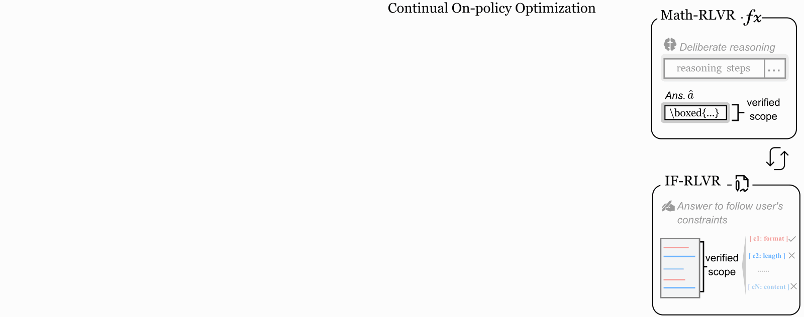
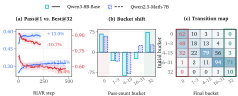
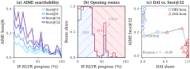
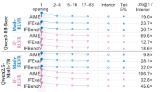
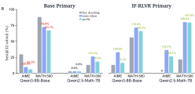

<p align="center">
  
</p>

<h2 align="center">Verifier-Induced Support Reshaping in On-Policy Optimization</h2>

<p align="center">
  Shaohang Wei<sup>1‡</sup>, Zikun Su<sup>2</sup>, Feifan Song<sup>1</sup>,
  Wen Luo<sup>1</sup>, Wei Li<sup>1</sup>, Guangyue Peng<sup>1</sup>, Houfeng Wang<sup>1†</sup>
</p>

<p align="center">
  <sup>1</sup>Peking University &nbsp; <sup>2</sup>BUPT<br>
  <sup>‡</sup> Project Lead &nbsp; <sup>†</sup> Corresponding Author<br>
  Correspondence: <a href="mailto:wanghf@pku.edu.cn">wanghf@pku.edu.cn</a>
</p>

<p align="center">
  <a href="https://arxiv.org/abs/2608.00220"></a>
  <a href="https://sylvain-wei.github.io/VISR/"></a>
  <a href="LICENSE"></a>
  <a href="eval/README.md"></a>
</p>

<p align="center">
  <a href="https://sylvain-wei.github.io/VISR/"><b>Project Website ↗</b></a> &nbsp;·&nbsp;
  <a href="#overview">Overview</a> &nbsp;·&nbsp;
  <a href="#main-results">Results</a> &nbsp;·&nbsp;
  <a href="#key-findings">Findings</a> &nbsp;·&nbsp;
  <a href="#getting-started">Getting started</a> &nbsp;·&nbsp;
  <a href="#citation">Citation</a>
</p>

## Overview

**Can a model still discover successful behaviors for its next training objective?**
VISR studies how on-policy reinforcement learning with verifiable rewards (RLVR) changes this ability across mathematical reasoning and instruction following.
We define **effective rewardable support** as successful trajectories reachable within a fixed rollout budget.
Improving the current objective can make those trajectories harder to sample and reinforce in a later stage.

<p align="center">
  
</p>

<sub>[Read the paper](https://arxiv.org/pdf/2608.00220) · [Explore the project](https://sylvain-wei.github.io/VISR/#overview) · [Static SVG](docs/assets/figures/fig1-overview.svg) · [Figure PDF](docs/assets/figures/fig1-overview.pdf)</sub>

## Main results

**Math-RLVR improves average instruction-following success while reducing coverage under repeated sampling.**
The pattern appears in both model families on IFEval and IFBench.
Here, pass@1 measures average rollout success; best@32 measures the fraction of prompts with at least one successful response among 32 samples.

Changes from Base to the final Math-RLVR checkpoint, on the percentage scale:

| Model | Benchmark | Δ pass@1 | Δ best@32 |
| :-- | :-- | --: | --: |
| Qwen3-8B-Base | IFEval | +6.5% | −9.8% |
| Qwen2.5-Math-7B | IFEval | +7.9% | −11.4% |
| Qwen3-8B-Base | IFBench | +3.2% | −6.7% |
| Qwen2.5-Math-7B | IFBench | +1.6% | −3.7% |

**In the reverse direction, IF-RLVR lowers math searchability.**
On AIME, best@k decreases at every tested budget (`k = 4, 8, 16, 32`), while visible response openings shift from step-by-step reasoning toward direct answers.

<details>
<summary><b>View the training curves and opening-route analysis</b></summary>

<p align="center">
  
</p>

<p align="center">
  
</p>

</details>

<sub>[Explore the full results](https://sylvain-wei.github.io/VISR/#findings)</sub>

## Response openings and math searchability

<table>
  <tr>
    <td width="50%"></td>
    <td width="50%"></td>
  </tr>
</table>

The first response token has the largest mean distribution shift in every tested model, verifier, and benchmark combination.
Forcing Base-side or deliberative openings from IF-RLVR checkpoints improves best@32 on AIME and MATH-500 in both model families.
These controlled interventions show that response openings affect math searchability in the tested settings.

<sub>[Position sweeps and intervention details](https://sylvain-wei.github.io/VISR/#mechanism)</sub>

## Key findings

- **Average success and sampling coverage can move in opposite directions.** A higher pass@1 can coexist with fewer prompts yielding any successful response within a fixed budget.
- **Response openings matter for later search.** Token-distribution measurements and controlled interventions identify the opening as a point where RLVR changes which successful responses remain reachable.
- **Preservation remains partial.** Reference-policy constraints and opening priors provide limited retention in the tested settings; on-policy distillation outcomes depend on the teacher checkpoint.

## Getting started

The repository includes the training framework, evaluation pipeline, analysis scripts, and selected paper tables.
Paper checkpoints and raw rollouts are not bundled; see [resource availability](REPRODUCIBILITY.md).

```bash
git clone https://github.com/sylvain-wei/VISR.git
cd VISR
```

| Task | Guide |
| :-- | :-- |
| Install dependencies and configure models / data | [Evaluation setup](eval/README.md) |
| Run a small check or the full evaluation | [Evaluation commands](eval/README.md#quick-validation) |
| Inspect training recipes and their requirements | [Training scope](REPRODUCIBILITY.md#training-boundary) · [DAPO reference recipe](configs/dapo/README.md) |
| Inspect analyses and released tables | [Analysis guide](analysis/README.md) · [Paper tables](analysis/paper/tables/) |

After installing the evaluation environment and configuring checkpoint and dataset paths:

```bash
cd eval
python scripts/check_env.py --strict
bash scripts/dry_run.sh
bash scripts/run_rq1_required.sh
```

## License and acknowledgments

Code and repository documentation use the [Apache License 2.0](LICENSE); paper figures retain their [CC BY 4.0 license](docs/assets/figures/README.md).
We build on verl and evaluation components from Google Research IFEval and AllenAI IFBench.
See [third-party notices](THIRD_PARTY_NOTICES.md) and [asset credits](docs/assets/README.md) for attribution and license details.

## Citation

```bibtex
@misc{wei2026verifier,
  title         = {Verifier-Induced Support Reshaping in On-Policy Optimization},
  author        = {Shaohang Wei and Zikun Su and Feifan Song and Wen Luo and Wei Li and Guangyue Peng and Houfeng Wang},
  year          = {2026},
  eprint        = {2608.00220},
  archivePrefix = {arXiv},
  primaryClass  = {cs.LG},
  doi           = {10.48550/arXiv.2608.00220},
  url           = {https://arxiv.org/abs/2608.00220}
}
```
